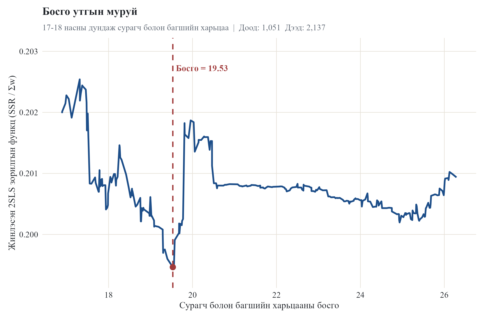
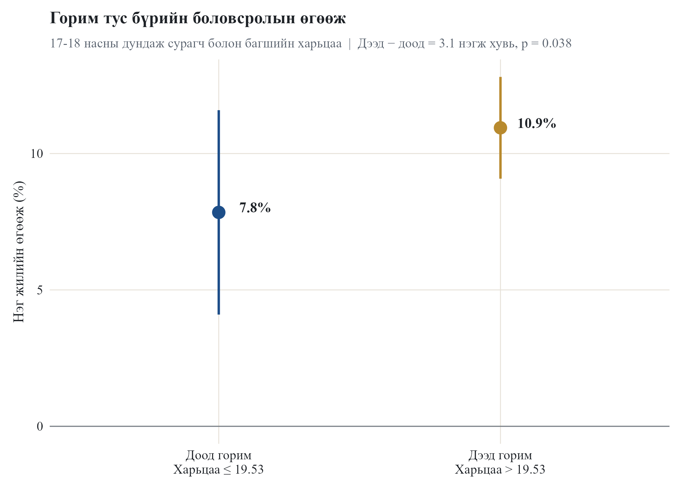
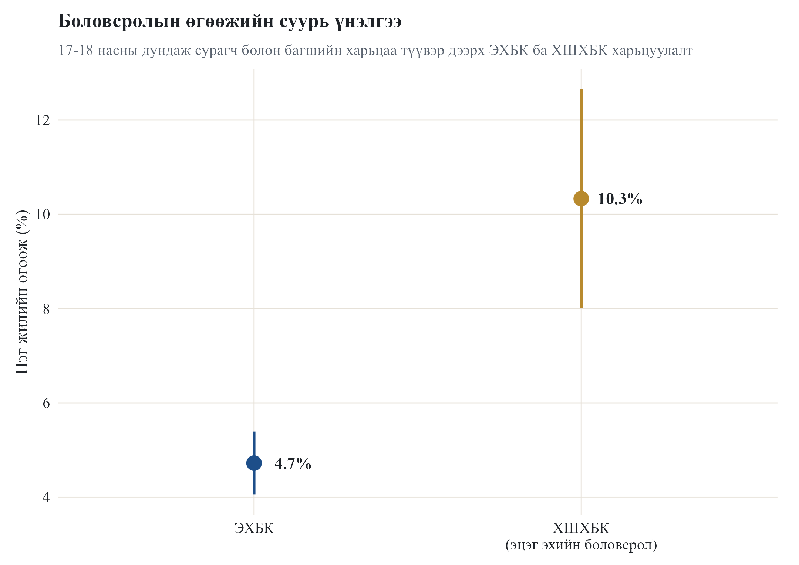

```{r setup, include=FALSE}
knitr::opts_chunk$set(
  echo = TRUE,
  eval = TRUE,
  message = FALSE,
  warning = FALSE,
  fig.align = "center",
  out.width = "92%"
)

read_table <- function(file) {
  read.csv(
    file.path("output", "tables", file),
    stringsAsFactors = FALSE,
    check.names = FALSE
  )
}

num <- function(x, digits = 3) {
  ifelse(is.na(x), NA, formatC(as.numeric(x), format = "f", digits = digits))
}

pval <- function(x) {
  x <- as.numeric(x)
  ifelse(x < 0.001, "<0.001", formatC(x, format = "f", digits = 3))
}
```

# Үр дүн

## 1. Sample diagnostics

```{r sample-diagnostics}
sample_diag <- read_table("T14a_student_teacher_avg_17_18_threshold_sample_diagnostics.csv")

sample_results <- data.frame(
  N = sample_diag$N[1],
  `Birth aimag clusters` = sample_diag$n_birth_aimag_clusters[1],
  `Birth cohort groups` = sample_diag$n_birth_cohort_groups[1],
  Waves = sample_diag$n_waves[1],
  `Age min` = sample_diag$age_min[1],
  `Age max` = sample_diag$age_max[1],
  `Threshold median` = num(sample_diag$student_teacher_ratio_avg_17_18_p50[1]),
  `Threshold unique values` = sample_diag$student_teacher_ratio_avg_17_18_unique_values[1],
  check.names = FALSE
)

knitr::kable(sample_results, caption = "Хүснэгт 1. 17-18 threshold sample diagnostics")
```

## 2. First-stage үр дүн

```{r first-stage}
fs <- read_table("T14a_student_teacher_avg_17_18_parent_iv_first_stage.csv")

first_stage_results <- data.frame(
  N = fs$N[1],
  IV = fs$term[1],
  Estimate = num(fs$estimate[1]),
  SE = num(fs$se[1]),
  `First-stage F` = num(fs$first_stage_F[1], 2),
  `p-value` = pval(fs$p_value[1]),
  `Weak IV` = ifelse(isTRUE(fs$weak_iv_flag_F_lt_10[1]), "Тийм", "Үгүй"),
  check.names = FALSE
)

knitr::kable(first_stage_results, caption = "Хүснэгт 2. parent_educ_mean IV-ийн first-stage үр дүн")
```

## 3. OLS болон 2SLS baseline

```{r baseline}
baseline <- read_table("T14a_student_teacher_avg_17_18_baseline_ols_2sls.csv")

baseline_results <- data.frame(
  Model = baseline$model,
  N = baseline$N,
  Term = baseline$term,
  Estimate = num(baseline$estimate),
  SE = num(baseline$se),
  `p-value` = pval(baseline$p_value),
  check.names = FALSE
)

knitr::kable(baseline_results, caption = "Хүснэгт 3. OLS болон 2SLS baseline")
```

## 4. Threshold estimate ба sample split

```{r gamma}
gamma <- read_table("T14c_student_teacher_avg_17_18_ch_gamma_hat.csv")

gamma_results <- data.frame(
  `Threshold variable` = gamma$threshold_variable[1],
  `Gamma hat` = num(gamma$gamma_hat[1]),
  N = gamma$N[1],
  `Low regime N` = gamma$N_low[1],
  `High regime N` = gamma$N_high[1],
  `Low 2SLS beta` = num(gamma$beta_low_2sls[1]),
  `High 2SLS beta` = num(gamma$beta_high_2sls[1]),
  check.names = FALSE
)

knitr::kable(gamma_results, caption = "Хүснэгт 4. Threshold estimate ба sample split")
```

## 5. IVTR GMM final results

```{r gmm}
gmm <- read_table("T14d_student_teacher_avg_17_18_ch_gmm_final_results.csv")

gmm_results <- data.frame(
  Term = gmm$term,
  Estimate = num(gmm$estimate),
  SE = num(gmm$se),
  `t-stat` = num(gmm$t_stat, 2),
  `p-value` = pval(gmm$p_value),
  `High - Low` = num(gmm$beta_difference_high_minus_low),
  check.names = FALSE
)

knitr::kable(gmm_results, caption = "Хүснэгт 5. IVTR GMM final results")
```

## 6. Wald test

```{r wald}
wald <- read_table("T14d_student_teacher_avg_17_18_ch_gmm_wald_test.csv")

wald_results <- data.frame(
  `Wald statistic` = num(wald$wald_statistic[1]),
  df1 = wald$df1[1],
  df2 = wald$df2[1],
  `p-value` = pval(wald$p_value[1]),
  check.names = FALSE
)

knitr::kable(wald_results, caption = "Хүснэгт 6. Горим хоорондын ялгааны Wald test")
```

## 7. 2SLS ба GMM харьцуулалт

```{r comparison}
comparison <- read_table("T14d_student_teacher_avg_17_18_ch_2sls_vs_gmm_comparison.csv")

comparison_results <- data.frame(
  `Threshold variable` = comparison$threshold_variable[1],
  `Gamma hat` = num(comparison$gamma_hat[1]),
  `Beta low 2SLS` = num(comparison$beta_low_2sls[1]),
  `Beta high 2SLS` = num(comparison$beta_high_2sls[1]),
  `Beta low GMM` = num(comparison$beta_low_GMM[1]),
  `Beta high GMM` = num(comparison$beta_high_GMM[1]),
  `GMM high-low` = num(comparison$beta_diff_GMM_high_minus_low[1]),
  check.names = FALSE
)

knitr::kable(comparison_results, caption = "Хүснэгт 7. 2SLS ба GMM харьцуулалт")
```

## 8. GMM matrix diagnostics

```{r matrix-diagnostics}
matrix_diag <- read_table("T14d_student_teacher_avg_17_18_ch_gmm_matrix_diagnostics.csv")

matrix_results <- data.frame(
  N = matrix_diag$N[1],
  `Low regime N` = matrix_diag$N_low[1],
  `High regime N` = matrix_diag$N_high[1],
  `Rank X` = matrix_diag$rank_X[1],
  `Rank Z` = matrix_diag$rank_Z[1],
  `Cluster S invertible` = matrix_diag$S_cluster_invertible[1],
  `Near-singular warning` = matrix_diag$near_singular_warning[1],
  check.names = FALSE
)

knitr::kable(matrix_results, caption = "Хүснэгт 8. GMM matrix diagnostics")
```

\newpage

# График

## 1. Threshold grid

```{r fig-grid, fig.cap="Зураг 1. 17-18 threshold grid objective"}

```

## 2. Regime-specific returns

```{r fig-regime, fig.cap="Зураг 2. 17-18 горим тус бүрийн боловсролын өгөөж"}

```

## 3. OLS ба 2SLS baseline

```{r fig-baseline, fig.cap="Зураг 3. 17-18 sample дээрх OLS ба 2SLS baseline"}

```

\newpage

# Кодын хавсралтын QR

```{r code-appendix-qr, echo=FALSE, out.width="62%", fig.align="center", fig.cap="Зураг 4. Судалгааны код, үр дүн, графикийн цахим хавсралтын QR код"}
qr_file <- "output/figures/code_appendix_qr.png"

if (file.exists(qr_file)) {
  knitr::include_graphics(qr_file)
} else {
  cat("QR зураг хараахан үүсээгүй байна. Public link гарсны дараа scripts/make_code_appendix_qr.py script-ээр output/figures/code_appendix_qr.png файлыг үүсгэнэ.")
}
```

QR кодыг уншуулснаар шинжилгээнд ашигласан R Markdown код, үр дүнгийн HTML хавсралт, графикуудыг бүрэн үзэх боломжтой.
